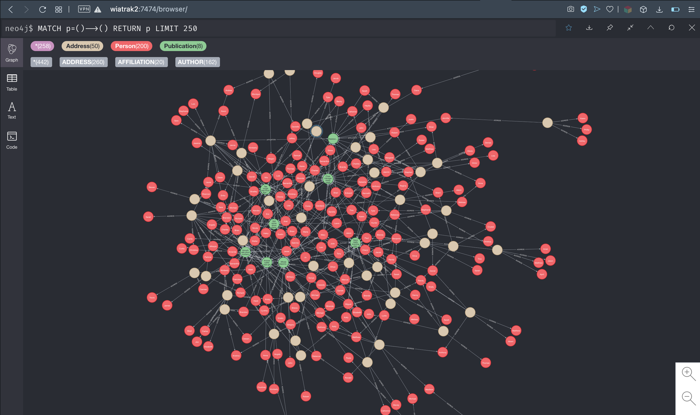

# pandas2neo4j

`pandas2neo4j` is a python package designed to easily exchange data between [pandas](https://pandas.pydata.org) `DataFrame` and [neo4j](https://neo4j.com) database. It uses [py2neo](https://py2neo.readthedocs.io) library to interact with the database.

## Installation
To install the package you need to clone it locally and use pip:
```bash
git clone https://github.com/wiatrak2/pandas2neo4j.git
cd pandas2neo4j
pip install .
```

## Basic usage
Check example [notebook](examples/pandas2neo4j_demo.ipynb) with usage demo.

### Graph initialization
`pandas2neo4j.PandasGraph` allows to connect a neo4j database instance with its URI:

```python
import pandas2neo4j

HOST = "wiatrak2:7687"
USERNAME = "neo4j"
PASSWORD = "s3cr3t"

pd_graph = pandas2neo4j.pandas_graph.PandasGraph(f"bolt://{USERNAME}:{PASSWORD}@{HOST}")
```

`pandas2neo4j.PandasModel` may be used to specify a node's structure. You can use typed properties provided in `pandas2neo4j.properties` to control model's schema - see [examples](examples/models.py).

To construct `pandas.DataFrame`s we will use data generated with [faker](https://github.com/joke2k/faker) available in [examples/data](examples/data) `CSV` tables, representing some relations between three types of entities: people, publications and addresses.

### Creating nodes
Transforming a table's rows into `pandas2neo4j.PandasModel` instances as well as nodes in the neo4j database you have to call a single method:
```python
import pandas as pd
from models import Address

addresses_df = pd.read_csv("data/addresses.csv")
addresses_models = pd_graph.create_nodes_from_dataframe(addresses_df, Address)
print(addresses_models)
# 0        <Address uuid=0>
# 1        <Address uuid=1>
# 2        <Address uuid=2>
# 3        <Address uuid=3>
# 4        <Address uuid=4>
#               ...
# 495    <Address uuid=495>
# 496    <Address uuid=496>
# 497    <Address uuid=497>
# 498    <Address uuid=498>
# 499    <Address uuid=499>
# Length: 500, dtype: object
```
Returned `pd.Series` corresponds to the rows of `addresses_df` table and can be easily integrated with it.
___
If `addresses_people_df` is a table representing relations between rows of `addresses` and `people` tables (with `uuid`s of related values stored in `address_uuid` and `person_uuid` columns), which rows have already been transformed into `Address` and `Person` models with `create_nodes_from_dataframe` method, you can create the `ADDRESS` relationship represented as `py2neo.Relationship` objects with:
```python
addresses_people = pd_graph.create_relationships_from_dataframe(
    addresses_people_df,
    "ADDRESS",
    Address,
    Person,
    "address_uuid",
    "person_uuid",
    chunk_size=1000,
)
print(addresses_people[0])
# ADDRESS(Node('Address', city='South Nicoleburgh', country='Austria', lat=59.413341, lon=57.306847, uuid=0), Node('Person', company='Schaefer-Morris', email='ashleypowell@chang.biz', firstname='Wendy', lastname='Ramos', phone_number='+1-016-246-2240x0680', uuid=0))
```
Using these two methods on `DataFrame`s constructed with the provided data gives you a graph with all the data ready:


### Handling existing nodes
If you connect to already existing non-empty neo4j database you can create `pandas2neo4j.PandasModel` instances from existing nodes with:
```python
person_models = pd_graph.get_graph_models(Person)
print(person_models[0].lastname)
# Ramos
```
You can match the existing nodes with rows of a `DataFrame` too. To map nodes with `addresses_df` table by `uuid` column and property you can use:
```python
models_for_df = pd_graph.get_models_for_dataframe(addresses_df, Address, "uuid")
print(models_for_df)
#     uuid            Address
# 0      0   <Address uuid=0>
# 1      1   <Address uuid=1>
# 2      2   <Address uuid=2>
# 3      3   <Address uuid=3>
# 4      4   <Address uuid=4>
# 5      5   <Address uuid=5>
# 6      6   <Address uuid=6>
```
to get a `DataFrame` where rows contain `Address` instances for `uuid` matching `addresses_df` table. If you'd like to use different name of column and property to match you should specify the `node_id_property` argument.
___
You can create a `DataFrame` containing all nodes/models data with `PandasGraph.get_dataframe_for_label` and `PandasGraph.get_dataframe_for_model` methods. They return a table where each row correspond to a single node and columns are the node's property. You can specify which properties should be used with `columns` parameter.
```python
addresses_in_graph_df = pd_graph.get_dataframe_for_label("Address")
print(addresses_in_graph_df[:3])
#       country         lon            city  uuid        lat
# 0  Bangladesh -123.351771       New Jamie     2  -0.412780
# 1    Kiribati  -62.894170  Vincentborough     3  73.658648
# 2      Uganda  146.282126       Colinstad     4  34.262528
```

```python
people_in_graph_df = pd_graph.get_dataframe_for_models(Person, columns=["uuid", "firstname", "lastname"])
print(people_in_graph_df[:3])
#    uuid    firstname  lastname
# 0     0        Wendy     Ramos
# 1     1  Christopher    Madden
# 2     2       Marcus  Guerrero
```

### Handling existing relationships
To get `ADDRESS` relationships where one of nodes is provided in the `DataFrame` constructed with `Person` models available in graph you should use `PandasGraph.get_relationships` method:
```python
people_for_df = pd_graph.get_models_for_dataframe(people_df, Person, "uuid")
people_addresses = pd_graph.get_relationships("ADDRESS", people_for_df["Person"])
print(people_addresses[0])
# ADDRESS(Node('Address', city='East Maria', country='Monaco', lat=-153.405541, lon=143.756567, uuid=26), Node('Person', company='Hayes-King', email='joe54@yahoo.com', firstname='Brent', lastname='Clark', phone_number='6221424285', uuid=949))
```
with `inner_only=True` parameter you can get relationships where both nodes are provided in the `nodes` argument.
___
Existing relationships can be matched with given `DataFrame` as well:
```python
relationships_in_graph = pd_graph.get_relationships_for_dataframe(
    addresses_publications_df, "AFFILIATION", Address, Publication, "address_uuid", "publication_uuid"
)
print(relationships_in_graph)
#      address_uuid  publication_uuid AFFILIATION
# 0             0.0               0.0          {}
# 1             0.0              86.0          {}
# 2             0.0              25.0          {}
# 3             0.0              77.0          {}
# 4             1.0               1.0          {}
# ..            ...               ...         ...
# 195          48.0              79.0          {}
# 196          49.0              49.0          {}
# 197          49.0              17.0          {}
# 198          49.0              48.0          {}
# 199          49.0              26.0          {}
#
# [200 rows x 3 columns]
```
This way you can get the `AFFILIATION` relationship matching rows of the `DataFrame` where `Address` models are matched by `address_uuid` column and `Publication` models are matched by `publication_uuid` column. To match a node its `__primarykey__` is used, to match by custom value you can use `from_model_id_key` and `to_model_id_key` parameters.
___
You can dump relationships graph's relationships into a `DataFrame`:
```python
addresses_in_graph = pd_graph.get_dataframe_for_relationship(
    "ADDRESS", from_node_property="uuid", to_node_property="uuid"
)
print(addresses_in_graph)
#      uuid_from  uuid_to
# 0            2      498
# 1            2      896
# 2            2      358
# 3            2      798
# 4            2      730
# ..         ...      ...
# 490          1      711
# 491          1      173
# 492          1      126
# 493          1      941
# 494          1        1
#
# [495 rows x 2 columns]
```
This execution gives all the available `ADDRESS` relationships. You could restrict the relationships with `nodes` argument (and `inner_only` to restrict them even more).
